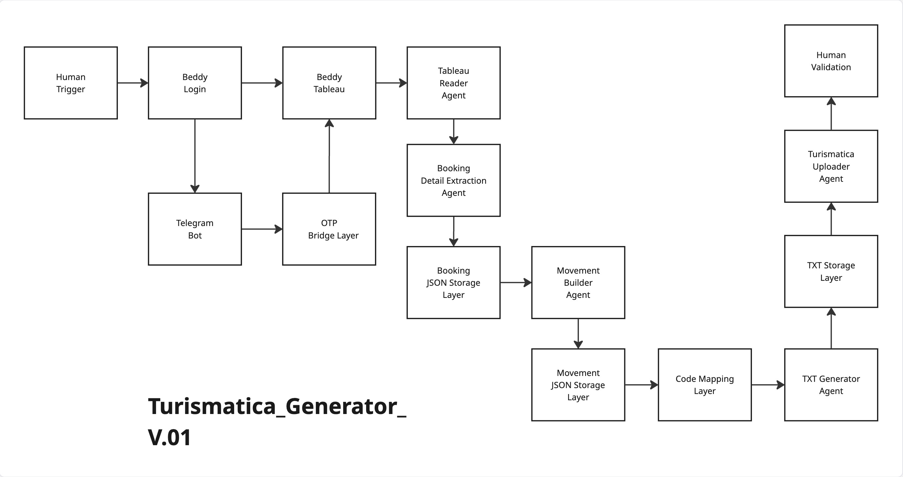

# Turismatica Generator

Multi-agent operational system designed to extract monthly reservation data, transform it into daily movement files, convert them into canonical TXT submissions, and upload them to the Turismatica portal through automated workflow steps.

*Structured reporting pipeline built to turn fragmented booking data into compliant daily submissions for an external tourism reporting system.*

Turismatica Generator is a modular automation system created to handle a multi-step reporting workflow that would otherwise require repetitive manual work, format conversion, and portal interaction.

The project is built around a chained operational logic: data is extracted, reorganized, converted into the required reporting format, and then uploaded through an automated submission flow.  
Its value lies in transforming a fragmented compliance process into a structured, repeatable system.

## What it does

- Extracts monthly reservation data from a property management system
- Transforms reservation information into daily movement files
- Converts daily movement data into canonical TXT files required by the Turismatica portal
- Maps and inserts required coded values such as nationality codes and reporting fields
- Uploads the generated TXT files day by day through an automated portal interaction

## System structure

- **Extraction layer**  
  An automation process enters the management software and gathers monthly reservation data.

- **Movement generation layer**  
  A second agent restructures the extracted data into daily movement files.

- **Canonical conversion layer**  
  A third agent converts daily movement data into TXT files following the exact format required by the reporting portal.

- **Submission layer**  
  A final automation process uploads the generated TXT files into the Turismatica portal day by day.

## System flow

The system operates as a chained multi-agent workflow:

1. A human trigger starts the process.
2. The automation enters Beddy and reaches the booking tableau.
3. A reading layer identifies the relevant bookings and extracts booking details.
4. Reservation data is stored in a structured JSON layer.
5. A movement builder transforms booking data into daily movement files.
6. Movement data is stored again in structured JSON form.
7. A code-mapping layer converts required fields into the canonical reporting values.
8. A TXT generator creates submission-ready TXT files in the exact format required by the Turismatica portal.
9. The generated TXT files are stored and passed to the uploader agent.
10. The uploader agent submits them day by day into the Turismatica portal.
11. A final human validation step confirms the result.

## Architecture diagram

## Input / Output

**Input**
- Monthly reservation data extracted from the Beddy management system
- Booking details required for daily movement generation

**Intermediate outputs**
- Structured booking JSON files
- Structured movement JSON files
- Canonical code-mapped reporting values

**Final output**
- Submission-ready TXT files in the exact format required by the Turismatica portal
- Day-by-day upload workflow with final human validation

## Component roles

- **Tableau Reader Agent**  
  Reads the booking tableau and identifies the relevant reservations.

- **Booking Detail Extraction Agent**  
  Extracts the booking-level data required for reporting.

- **Booking JSON Storage Layer**  
  Preserves structured reservation data before downstream transformations.

- **Movement Builder Agent**  
  Converts extracted reservations into daily movement records.

- **Movement JSON Storage Layer**  
  Stores intermediate movement-level data in structured form.

- **Code Mapping Layer**  
  Converts raw booking and movement values into canonical reporting codes.

- **TXT Generator Agent**  
  Generates submission-ready TXT files in the exact reporting format.

- **TXT Storage Layer**  
  Preserves the generated TXT outputs before submission.

- **Turismatica Uploader Agent**  
  Uploads the generated TXT files into the Turismatica portal.

- **Human Validation**  
  Confirms the final result at the end of the workflow.

## Why this architecture exists

This system is structured as a multi-layer workflow because the reporting process is not a single action, but a sequence of dependent transformations.

The separation between extraction, JSON storage, movement generation, code mapping, TXT generation, and upload creates a more stable architecture with clearer validation points.  
It also makes the system easier to debug, evolve, and supervise over time.

Instead of relying on one monolithic automation, the workflow preserves intermediate structured states and isolates the most fragile logic into dedicated layers.

## Real-world constraints

This project was designed around real operational constraints, including:

- external management-system extraction
- canonical TXT formatting requirements
- coded reporting fields such as nationality mappings
- day-by-day submission structure
- reliability across multiple transformation steps
- final human validation before closing the process

Because of these constraints, the architecture prioritizes structure, traceability, and modularity over simplistic one-step automation.

## Operational proof

This system was designed as a real hospitality reporting workflow, not as a conceptual prototype.  
It processes booking data through multiple transformation layers, generates canonical TXT outputs, and supports structured submission into the real reporting portal with final human validation.

## Why it matters

Tourism reporting workflows are often operationally fragile because they depend on manual extraction, file preparation, format compliance, and repetitive submission steps.  
This project exists to remove that friction by turning the entire process into a modular reporting pipeline.

Its value is not limited to automation speed: it creates consistency, reduces submission risk, and structures a compliance workflow that would otherwise remain error-prone and time-consuming.

## Multi-agent logic

Turismatica Generator is not built as a single monolithic script.  
Its architecture is based on a sequence of distinct agents, each handling a specific operational transformation:

- extract
- restructure
- convert
- submit

This separation makes the workflow easier to reason about, validate, and evolve over time.

## Status

Active internal project with functioning extraction, movement generation, canonical TXT conversion, and automated submission logic.  
The system is already operational as a real reporting workflow for structured tourism compliance tasks.

## Scope

This project is designed as a focused internal reporting and submission system for a specific hospitality compliance workflow.  
It is not intended as a generic SaaS reporting platform, but as a custom multi-agent architecture built around concrete data flows, canonical formatting requirements, and external portal submission needs.
